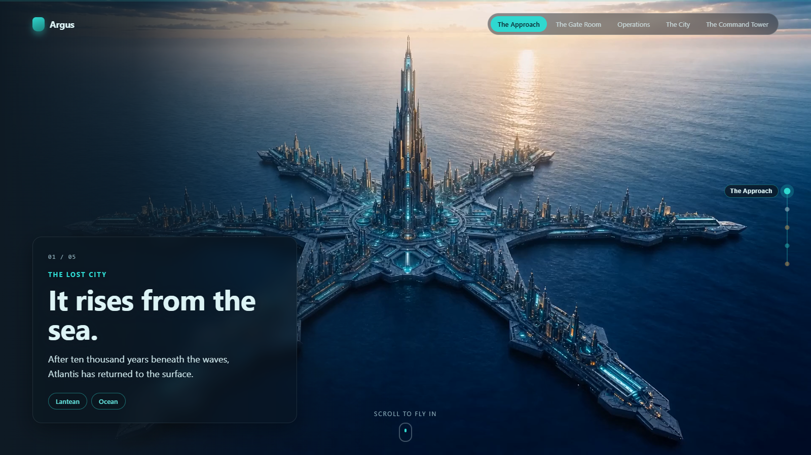
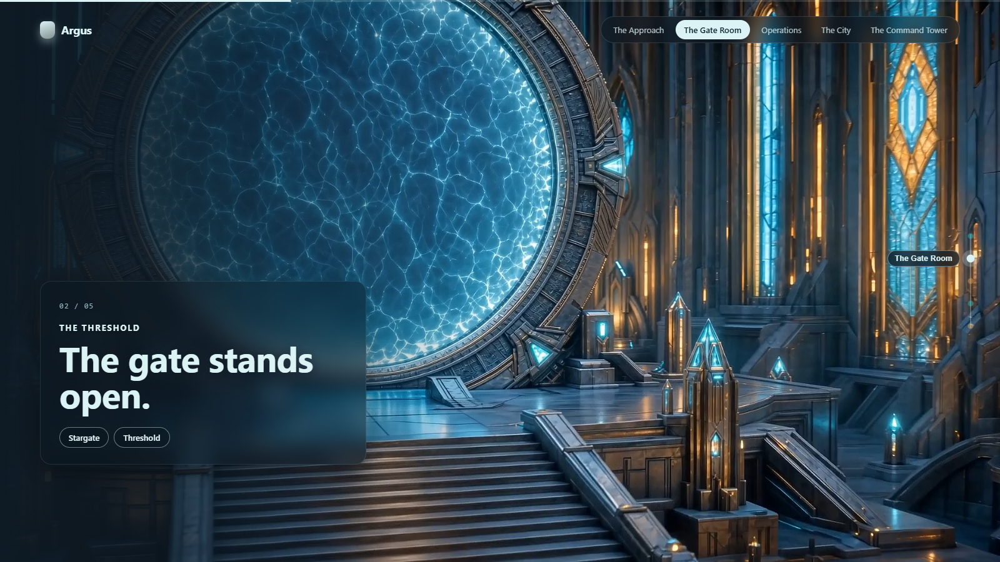
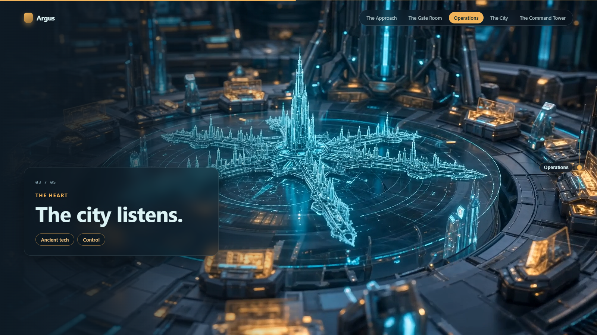
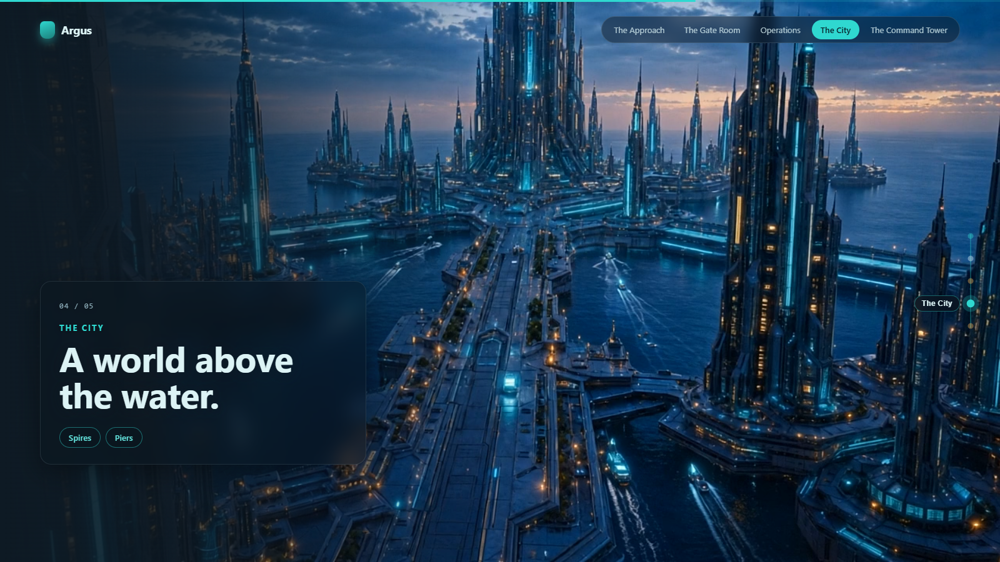
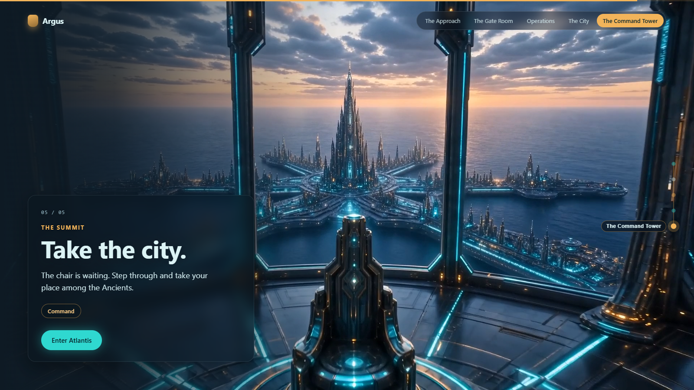

# Argus — Fly Through Atlantis

A single scroll-scrubbed landing page that flies you through a lost city. As you scroll, a pre-rendered camera flies from outside each scene into its interior, then flows into the next — one continuous connected flight, no cuts. A non-commercial fan tribute to Atlantis.

**Live demo:** https://argus-atlantis.vercel.app


## What it is

Five dive scenes, bridged by four connector clips, wired into one seamless flight. The engine loads each clip as a Blob and scrubs `currentTime` against scroll position — the video is the scroll. Built with the [`scroll-world`](https://claude.ai/) skill engine; all art generated with the Higgsfield CLI and encoded with ffmpeg.

## The scenes

| # | Scene | Line |
|---|-------|------|
| 01 | **The Approach** — *It rises from the sea.* |  |
| 02 | **The Gate Room** — *The gate stands open.* |  |
| 03 | **Operations** — *The city listens.* |  |
| 04 | **The City** — *A world above the water.* |  |
| 05 | **The Command Tower** — *Take the city.* |  |

## Run locally

Static files only — no build, no dependencies.

```bash
python -m http.server 8123
# open http://127.0.0.1:8123/
```

(The `favicon.ico` 404 in the console is expected — no favicon ships.)

## Architecture

Two files ship:

- **`index.html`** — the config. Calls `mountScrollWorld(container, config)` with the five `sections[]`, four `connectors[]`, brand, theme vars, and scroll tuning. All art direction lives here.
- **`scrub-engine.js`** — the engine, vendored verbatim from the `scroll-world` skill. Framework-agnostic vanilla JS, zero deps; builds its own `.sw-*` DOM + CSS into the container.

The flight is an interleaved chain: `dive0, conn0, dive1, conn1, … diveN-1`. The **seam contract** makes it seamless — a connector's first frame equals the previous dive's last frame, its last frame the next dive's first frame (SSIM-verified during generation). `connectors.length === sections.length - 1`.

**Mobile:** phone-tier clips (`clipMobile`/`posterMobile`) key off device class; seek-coalescing and poster-hold harden behaviour on coarse-pointer / small viewports. An automatic **stills mode** (reduced-motion, data-saver, iOS Low Power) cross-dissolves stills with no video decode.

## Built with

- **Engine:** [`scroll-world`](https://claude.ai/) skill — portable scroll-scrub landing-page engine
- **Assets:** Higgsfield CLI (image + video generation) → ffmpeg (`libx264`, small GOP for cheap scrub seeks) → `cwebp` posters
- No framework, no package manager, no build step

## Disclaimer

Argus is a non-commercial fan tribute inspired by Atlantis. Not affiliated with or endorsed by any rights holder.
